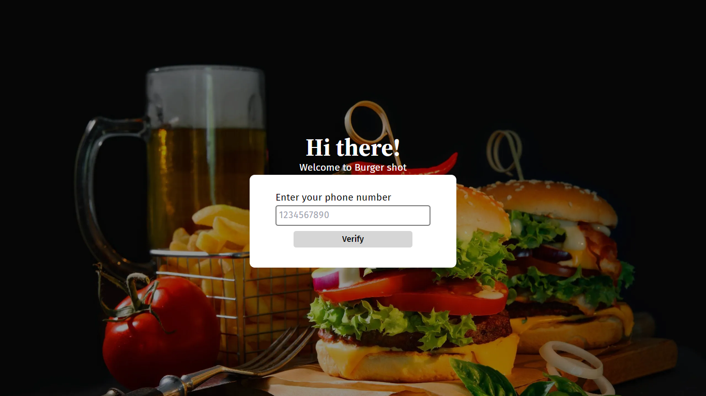
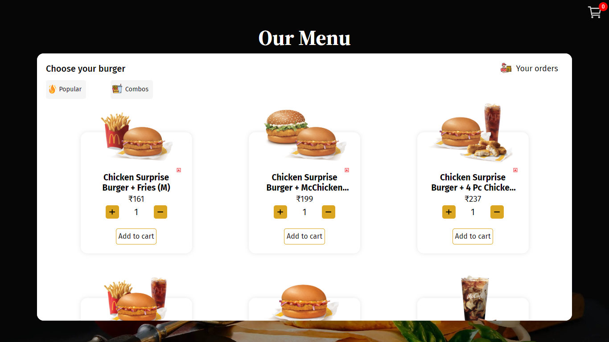
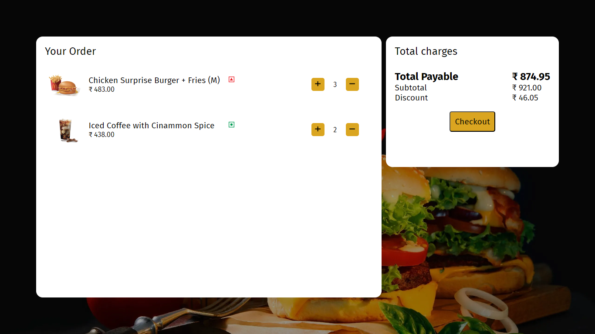
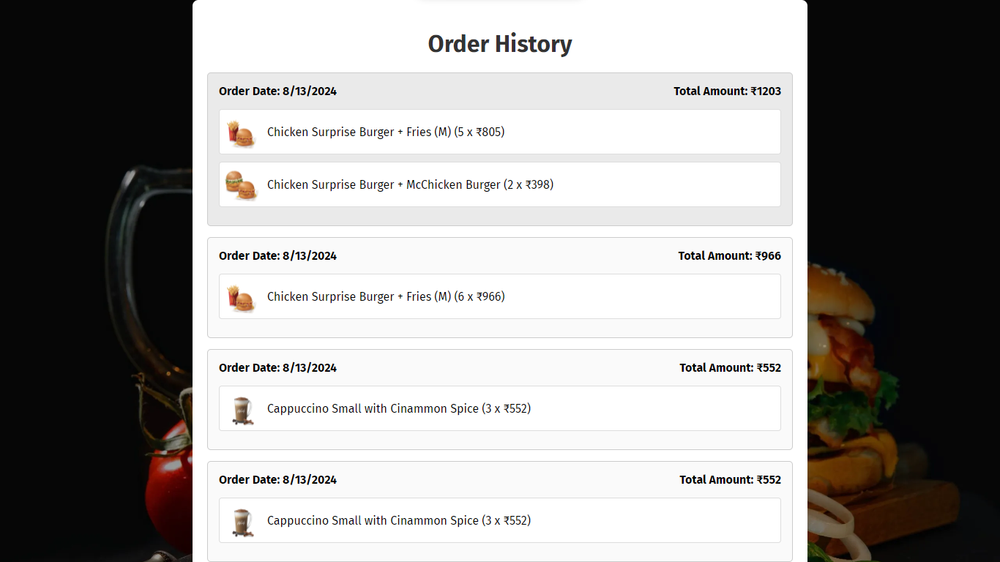

### 1. Project Title
**Burger Shot**
 
### 2. Project Description
Provide a brief description of your project. For example:
 
**Burger Shot** is a responsive web application for ordering burgers online. It allows users to browse the menu, add items to the cart, place orders, and receive a confirmation. The project includes various features like an interactive menu, a dynamic cart, and order management.
 
### 3. Folder Structure
Outline the folder structure to give an overview of the project's organization:
 
```
├── assets/
│   ├── css/           # Stylesheets for the project
│   ├── images/        # Image assets like logos, burger images, etc.
│   ├── scripts/       # JavaScript files for dynamic functionality
│   ├── sounds/        # Audio files, if any
├── burgers_menu.html  # The main menu page for burgers
├── cart.html          # Shopping cart page
├── index.html         # The homepage
├── orderspage.html    # Order management page
├── thanks.html        # Order confirmation/thank you page
```
 
### 5. Usage
Explain how to navigate through the application:
- **Homepage (`index.html`)**: The starting point with a welcoming interface.
- **Menu (`burgers_menu.html`)**: Browse through the burger options.
- **Cart (`cart.html`)**: Review your selected items and proceed to checkout.
- **Order Page (`orderspage.html`)**: Manage and track your orders.
- **Thank You Page (`thanks.html`)**: Displayed after a successful order.
 
### 6. Snapshots
You can include snapshots of your web pages to give visual references. Place these snapshots in the `assets/images` directory and link them in the README.
 
```markdown
### Screenshots
 
#### Login page

 
#### Menu Page


#### Menu Page with item in cart


#### Cart Page


#### Order history Page


#### Order Confirmation

```
 
### 8. Technologies Used
List the technologies and tools used in the project:
 
- HTML5 & CSS3 for structure and styling.
- JavaScript for interactivity.
- Tailwind CSS for reusable components.
- Toastify for push notifications for user actions.
